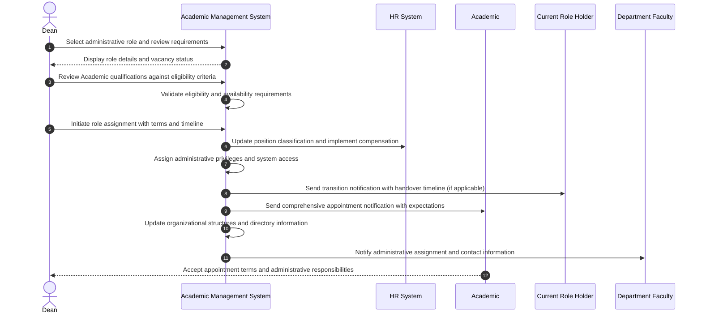

# Use Case: Assign Administrative Role to Academic

- Primary Actor: Dean
- Supporting Actors: Provost, HR Administrator, Current Role Holder, Academic, Department Faculty
- Stakeholders and Interests: Academic (leadership opportunity), Department (effective governance), University (administrative continuity), Faculty (representation)

- Goal: Successfully assign an administrative role (e.g., Head of Department, Associate Dean, Committee Chair) to an eligible Academic with proper authority transfer, system updates, and transition management.
- Scope: Academic Management System
- Level: User-goal

- Preconditions:

  1. Administrative role position exists and is either vacant or scheduled for planned transition
  2. Academic meets comprehensive eligibility requirements for the specific administrative role (rank, tenure, experience, performance)
  3. Academic has formally agreed to accept administrative responsibilities and time commitment
  4. Proper institutional approval authority exists for the role assignment level
  5. Budget allocation adequately covers administrative role compensation, release time, or stipend requirements

- Triggers:
  - Dean initiates assignment of administrative role following search committee process, emergency appointment needs, or planned succession

## Main Success Scenario

1. Dean accesses administrative role assignment interface and selects target position with comprehensive role requirements and responsibilities.
2. System displays detailed role requirements, responsibilities, authority level, compensation structure, and current vacancy status.
3. Dean reviews Academic's complete qualifications against role eligibility criteria including rank, tenure status, experience, and performance history.
4. System validates Academic meets all requirements (minimum rank level, tenure status, leadership experience, performance standards, availability).
5. Dean initiates formal role assignment with specified effective date, term length, compensation details, and transition timeline.
6. System generates comprehensive administrative appointment documentation with role-specific authorities, responsibilities, and institutional expectations.
7. HR Administrator updates Academic's position classification to include administrative role and implements compensation adjustment or release time.
8. System assigns appropriate administrative privileges, system access rights, budget authority, and decision-making permissions for the role.
9. Current role holder (if applicable) receives detailed transition notification with authority transfer timeline and handover responsibilities.
10. Academic receives formal appointment notification with comprehensive role expectations, resources available, and institutional support structure.
11. System updates organizational charts, faculty directory, reporting structures, and committee memberships reflecting new administrative assignment.
12. Department faculty and relevant stakeholders receive notification of new administrative assignment with effective date and contact information.

## Alternate/Exception Flows

A1. Academic fails to meet eligibility requirements:

1.  At step 4, system identifies qualification deficiency (insufficient rank level, lack of tenure, inadequate experience, performance concerns).
2.  Dean may request formal waiver approval from Provost, modify role requirements, or select alternative candidate.
3.  Assignment proceeds with approved waiver, role modification, or different Academic selection. Rejoin at step 3.

A2. Academic declines administrative appointment:

1.  After step 6, Academic formally declines administrative role offer citing personal, professional, or timing concerns.
2.  Dean must identify and approach alternative qualified candidates for the administrative position.
3.  Assignment process restarts with new candidate selection and evaluation. End current process.

A3. Budget insufficient for role compensation or release time:

1.  At step 7, HR identifies inadequate budget allocation for administrative stipend, course release, or support resources.
2.  Dean must secure additional budget approval, modify compensation structure, or adjust role scope and responsibilities.
3.  Assignment deferred pending budget resolution or proceeds with modified compensation terms and conditions.

A4. Current role holder contests transition timeline or circumstances:

1.  At step 9, current administrative role holder disputes transition schedule, handover requirements, or succession circumstances.
2.  Dean reviews transition terms and may negotiate extended overlap period, modified responsibilities, or alternative arrangements.
3.  Modified transition plan implemented with mutually agreed timeline and responsibilities. Rejoin at step 10.

## Postconditions

- Success Guarantees:
  - Academic successfully appointed to administrative role with appropriate authorities, resources, and institutional support
  - Compensation adjustments, release time, and workload modifications properly implemented and documented
  - System access privileges, decision-making authority, and administrative permissions align with role responsibilities
  - Reporting structures, organizational charts, and institutional directories reflect new administrative assignment accurately
- Minimal Guarantees:
  - Academic's primary faculty position, tenure status, and core academic rights remain protected and unaffected
  - Complete documentation exists for appointment terms, expectations, performance criteria, and evaluation procedures
  - Transition process managed to minimize disruption to department operations, faculty governance, and administrative continuity

## Business Rules

- Administrative roles typically require minimum Associate Professor rank or equivalent senior academic standing
- Tenure or tenure-track status usually required for senior administrative positions involving faculty governance
- Administrative appointment terms typically 3-5 years with possibility of renewal based on performance and institutional needs
- Administrative compensation includes appropriate stipend, course release, or workload adjustment commensurate with role scope
- Academic retains faculty rank, tenure rights, and career progression opportunities during administrative service period

## Non-Functional Notes

- Role assignment processing should complete within 5 business days of final approval and acceptance
- Administrative access privileges must activate immediately upon appointment effective date for operational continuity
- Sensitive administrative information and decision-making authority require enhanced security clearance and access controls
- System must maintain comprehensive audit trail of all administrative appointments, transitions, and authority changes

## Open Issues

- Define specific eligibility criteria variations by administrative role type, level, and institutional scope
- Clarify comprehensive procedures for emergency temporary administrative appointments and succession planning
- Determine conflict of interest screening requirements, disclosure procedures, and management protocols for administrative roles

## Diagram

