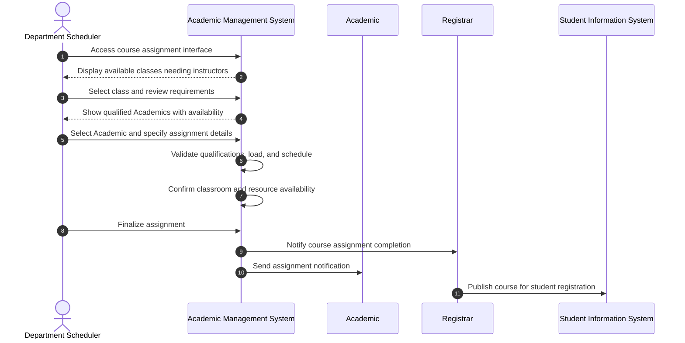

# Use Case: Assign Class to Academic

- Primary Actor: Department Scheduler
- Supporting Actors: Department Head, Academic, Registrar, Facilities Manager
- Stakeholders and Interests: Academic (workload balance), Students (course availability), Department (teaching coverage)

- Goal: Successfully assign a qualified Academic to teach a specific class with proper scheduling validation and resource allocation.
- Scope: Academic Management System
- Level: User-goal

- Preconditions:

  1. Class exists in course catalog with defined requirements
  2. Academic is employed with current active status
  3. Academic has appropriate qualifications for the subject area
  4. Scheduling period is open for course assignments
  5. Classroom and resource availability confirmed

- Triggers:
  - Department Scheduler initiates class assignment during course planning period

## Main Success Scenario

1. Department Scheduler accesses course assignment interface for upcoming term.
2. System displays available classes requiring instructor assignment with course details.
3. Scheduler selects specific class and reviews course requirements and constraints.
4. System presents qualified Academics list with current teaching loads and availability.
5. Scheduler selects appropriate Academic and specifies assignment parameters (time, location).
6. System validates Academic's qualifications against course requirements.
7. System checks Academic's current teaching load against contractual limits.
8. System verifies no scheduling conflicts with Academic's existing commitments.
9. System confirms classroom availability and capacity alignment with enrollment projections.
10. Scheduler finalizes class assignment with approved schedule and location.
11. System updates Academic's teaching schedule and course roster.
12. Registrar receives notification to publish course in student registration system.
13. Academic receives class assignment notification with course access and materials.

## Alternate/Exception Flows

A1. Academic lacks required qualifications:

1.  At step 6, system identifies qualification deficiency (degree level, subject expertise, certification).
2.  System suggests alternative qualified Academics or waiver process.
3.  Scheduler selects different Academic or requests Department Head approval for exception.

A2. Teaching load limit exceeded:

1.  At step 7, system detects assignment would exceed Academic's contracted teaching load.
2.  System calculates overload compensation and flags for administrative approval.
3.  Department Head approves overload or Scheduler selects different Academic.

A3. Scheduling conflict detected:

1.  At step 8, system identifies time conflict with Academic's existing classes, meetings, or commitments.
2.  System suggests alternative time slots or displays Academic's availability windows.
3.  Scheduler adjusts schedule or selects different Academic. Rejoin at step 8.

A4. Classroom unavailable or inappropriate:

1.  At step 9, system identifies classroom booking conflict or capacity mismatch.
2.  System suggests alternative classrooms meeting course requirements.
3.  Scheduler selects appropriate classroom or requests facilities coordination.

## Postconditions

- Success Guarantees:
  - Class has confirmed qualified instructor with validated schedule
  - Academic's teaching load updated and within contractual limits
  - Course appears in registration system for student enrollment
  - All scheduling conflicts resolved and resources allocated
- Minimal Guarantees:
  - No double-booking of Academic, classroom, or resources
  - Teaching load calculations remain accurate across all assignments
  - Assignment decision audit trail maintained

## Business Rules

- Academic must possess degree level typically one above course level being taught
- Teaching load limits defined by employment contract and institutional policy
- Class size must not exceed classroom capacity or safety regulations
- Minimum 4-week advance notice required for new course preparations
- Prerequisites and co-requisites must be satisfied in course sequencing

## Non-Functional Notes

- Assignment processing should complete within same business day
- Real-time conflict checking prevents scheduling errors
- Integration with student information system required within 24 hours
- Mobile access for Academic schedule review and acknowledgment

## Open Issues

- Define qualification waiver approval process and criteria
- Clarify overload compensation calculation methodology
- Determine emergency substitute assignment procedures

## Diagram

