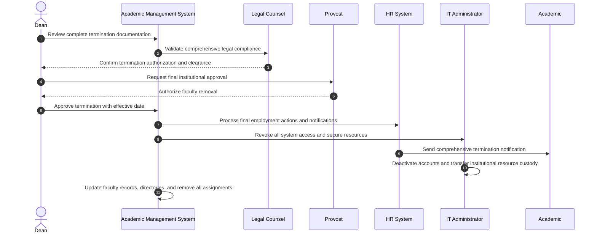

# Use Case: Remove Academic from Faculty

- Primary Actor: Dean
- Supporting Actors: HR Administrator, Legal Counsel, Provost, Department Head, IT Administrator
- Stakeholders and Interests: Academic (employment rights), University (institutional integrity), Faculty (due process), Students (continuity)

- Goal: Lawfully terminate an Academic's employment and remove them from faculty following comprehensive due process, legal requirements, and institutional procedures.
- Scope: Academic Management System
- Level: User-goal

- Preconditions:

  1. Academic is currently employed as active faculty member
  2. Serious misconduct, sustained performance failure, or program elimination justifies termination
  3. All required disciplinary procedures, due process steps, and improvement opportunities completed
  4. Legal review confirms compliance with employment contracts, tenure provisions, and applicable laws
  5. Appeals processes exhausted, waived, or legally resolved

- Triggers:
  - Dean receives final recommendation for faculty termination from disciplinary committee or authorization for program elimination layoffs

## Main Success Scenario

1. Dean reviews complete termination documentation including disciplinary findings, legal clearances, and procedural compliance verification.
2. System validates all required due process steps, notice periods, appeal opportunities, and procedural requirements completed.
3. Dean consults with Provost and Legal Counsel for final termination authorization and approval.
4. Dean formally approves Academic's removal from faculty effective specified date with comprehensive rationale.
5. System generates official termination notice with detailed justification and final employment terms.
6. HR Administrator processes final payroll calculations, benefits termination, COBRA notifications, and exit procedures.
7. System immediately revokes all Academic privileges (library access, email accounts, building access, research accounts, system access).
8. IT Administrator deactivates user accounts, transfers custody of institutional resources, and secures confidential information.
9. Department Head arranges emergency course coverage, research project transitions, and student advising reassignments.
10. Academic receives termination notification with final compensation details, benefit information, and legal rights explanation.
11. System comprehensively updates faculty directory, removes Academic from all committees, assignments, and institutional roles.
12. HR Administrator completes final employment documentation, regulatory reporting, and institutional notification requirements.

## Alternate/Exception Flows

A1. Legal compliance deficiency identified:

1.  At step 2, system or Legal Counsel identifies procedural gap, due process violation, or legal constraint.
2.  Termination suspended pending correction of compliance issues and additional procedural steps.
3.  Legal requirements satisfied or termination cancelled. Rejoin at step 1 or End if non-correctable.

A2. Academic files legal challenge or injunction:

1.  After step 5, Academic initiates lawsuit, regulatory complaint, or seeks court intervention challenging termination.
2.  All final termination steps administratively stayed pending legal resolution and court decisions.
3.  Termination proceeds, modified, or reversed based on legal outcome and judicial determination.

A3. Tenure complications or protections arise:

1.  At step 3, Legal Counsel identifies tenure protections or contractual provisions preventing or complicating termination.
2.  Alternative disciplinary measures, negotiated separation, or enhanced documentation procedures explored.
3.  Termination cancelled in favor of alternative resolution or proceeds with additional legal safeguards.

A4. Academic negotiates resignation in lieu of termination:

1.  Between steps 1-5, Academic proposes voluntary resignation with mutually agreed terms and conditions.
2.  Parties negotiate resignation agreement with confidentiality, reference, and transition provisions.
3.  Voluntary resignation process replaces involuntary termination workflow. End.

## Postconditions

- Success Guarantees:
  - Academic's employment terminated with all legal, contractual, and procedural requirements satisfied
  - All institutional access, privileges, and system accounts revoked and secured appropriately
  - Course responsibilities, research projects, and student relationships transitioned to ensure continuity
  - Complete documentation maintained for legal defense, audit, and institutional protection purposes
- Minimal Guarantees:
  - No termination occurs until all legal and procedural requirements fully satisfied
  - Academic receives all contractually required compensation, benefits, and legal protections
  - Institutional resources, confidential information, and intellectual property properly secured

## Business Rules

- Termination for cause requires documented serious misconduct or repeated performance failures with improvement opportunities
- Academic must receive contractually required notice period (typically 30-90 days depending on position and tenure status)
- Tenure protections require extraordinary circumstances, enhanced due process, and often external review
- Final compensation must include accrued vacation, sabbatical credits, research account balances, and contractual severance
- Post-employment restrictions (non-compete, confidentiality, intellectual property) remain enforceable and must be communicated

## Non-Functional Notes

- All termination actions require comprehensive legal review, documentation, and senior administrative approval
- Sensitive employment decisions must maintain strict confidentiality with need-to-know access controls
- System access revocation must be immediate and comprehensive upon termination effective date
- Complete audit trail required for potential legal proceedings, regulatory compliance, and institutional protection

## Open Issues

- Define specific procedures for research data custody, intellectual property transfers, and ongoing project management
- Clarify student advising transition requirements, timeline, and responsibility assignments for terminated faculty
- Determine institutional reference, recommendation, and employment verification policies for terminated academics

## Diagram

