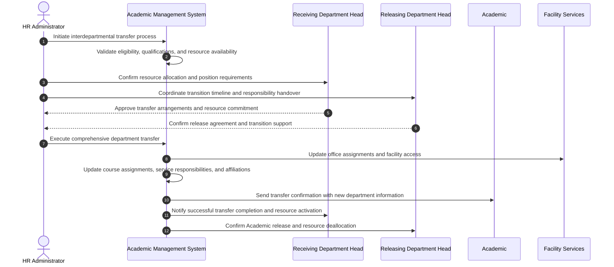

# Use Case: Transfer Academic Between Departments

- Primary Actor: HR Administrator
- Supporting Actors: Receiving Department Head, Releasing Department Head, Provost, Academic, Facilities Manager
- Stakeholders and Interests: Academic (career opportunity), Departments (resource allocation), University (strategic positioning), Students (continuity)

- Goal: Successfully transfer an Academic from one department to another while validating eligibility, updating all related information, and ensuring seamless transition of responsibilities.
- Scope: Academic Management System
- Level: User-goal

- Preconditions:

  1. Academic is currently employed in active good standing
  2. Receiving department has approved position opening and resource allocation
  3. Releasing department has agreed to transfer (unless involuntary administrative transfer)
  4. Academic meets qualification requirements for position in receiving department
  5. Transfer effective date, terms, and conditions have been established and agreed upon

- Triggers:
  - HR Administrator receives completed transfer request with all required approvals from department heads and Academic

## Main Success Scenario

1. HR Administrator initiates interdepartmental transfer process with comprehensive approval documentation and eligibility verification.
2. System validates Academic's current employment status, performance record, disciplinary history, and transfer eligibility.
3. System verifies receiving department has appropriate position authorization, budget allocation, and resource capacity.
4. HR Administrator confirms Academic meets qualification requirements, degree standards, and competency expectations for target position.
5. System comprehensively checks for scheduling conflicts with existing commitments (courses, research, service, administrative duties).
6. HR Administrator coordinates detailed transfer timeline with both department heads, Academic, and affected stakeholders.
7. System updates Academic's primary department affiliation, reporting structure, budget allocation, and administrative assignments.
8. System transfers office space assignments, parking privileges, resource allocations, and facility access to receiving department.
9. Academic's course assignments, committee memberships, research affiliations, and service responsibilities updated for new department.
10. System updates comprehensive directory information, email distribution lists, organizational charts, and public profiles.
11. Both departments receive detailed confirmation of completed transfer with effective dates and transition responsibilities.
12. Academic receives updated employment documentation, new department information, and resource access confirmations.

## Alternate/Exception Flows

A1. Academic fails to meet receiving department qualifications:

1.  At step 4, system identifies qualification gaps (degree field mismatch, research area incompatibility, certification deficiency).
2.  Receiving Department Head may request formal qualification waiver, additional training plan, or modified position description.
3.  Transfer approved with conditions, deferred pending qualification completion, or cancelled entirely.

A2. Budget allocation or position unavailable:

1.  At step 3, system identifies insufficient budget allocation, position authorization, or resource capacity in receiving department.
2.  Transfer postponed pending budget approval, alternative funding identification, or position reclassification.
3.  Financial arrangements negotiated between departments, central administration, or transfer cancelled.

A3. Critical course coverage conflict identified:

1.  At step 5, system identifies essential course assignments or research commitments that cannot be adequately covered in releasing department.
2.  Transfer timeline adjusted to accommodate course completion, substitute instructor assignment, or research transition planning.
3.  Phased transfer implementation or delayed effective date negotiated. Rejoin at step 6 with revised timeline.

A4. Academic withdraws transfer request:

1.  Between steps 1-7, Academic decides to remain in current department due to changed circumstances or preferences.
2.  Transfer process cancelled and all preliminary arrangements, reservations, and commitments reversed.
3.  Academic continues in original department assignment with no changes. End.

## Postconditions

- Success Guarantees:
  - Academic successfully assigned to new department with appropriate resources, space, and support
  - All institutional systems reflect updated department affiliation and reporting relationships accurately
  - Budget allocations, space assignments, and resource access properly transferred and activated
  - Course assignments, service responsibilities, and research affiliations align with new department needs and expectations
- Minimal Guarantees:
  - Academic maintains continuous employment status and benefits throughout entire transfer process
  - Original department affiliation preserved and functional until complete transfer implementation
  - Comprehensive audit trail maintained documenting transfer process, approvals, and timeline

## Business Rules

- Academic must maintain equivalent or higher position level unless voluntary demotion agreed upon
- Transfer cannot result in involuntary salary reduction unless disciplinary action or voluntary agreement
- Tenure status, sabbatical eligibility, and career progression rights transfer with Academic to new department
- Research grants, projects, and external funding may transfer subject to sponsor approval and department research capacity
- Service commitments and administrative roles must be completed, properly transitioned, or formally reassigned

## Non-Functional Notes

- Complete transfer process should finish within 60 calendar days of final approvals
- System updates must be coordinated to prevent data inconsistencies and access disruptions
- Confidential personnel information requires appropriate access controls and security during transfer process
- Integration with payroll, benefits, facility management, and academic support systems essential for seamless transition

## Open Issues

- Define comprehensive policies for shared or joint appointments between multiple departments
- Clarify research space allocation, equipment transfer, and laboratory access procedures for interdisciplinary transfers
- Determine graduate student advising transition requirements, timeline, and continuity protocols

## Diagram

