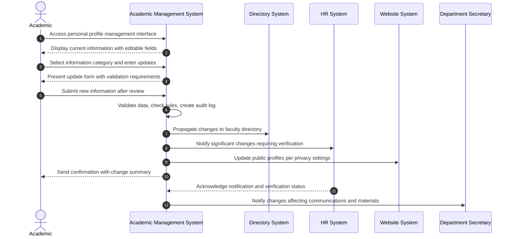

# Use Case: Update Academic Personal or Professional Information

- Primary Actor: Academic
- Supporting Actors: HR Administrator, Department Secretary, IT Administrator, Registrar
- Stakeholders and Interests: Academic (accurate records), University (current information), Students (contact accessibility), Administrative Staff (communication)

- Goal: Successfully update an Academic's personal or professional information in the system while maintaining data integrity, security, and appropriate approval workflows.
- Scope: Academic Management System
- Level: User-goal

- Preconditions:

  1. Academic has authenticated system access with appropriate permissions
  2. Academic's current employment status is active with update privileges
  3. Academic management system is operational with backup and audit logging functional
  4. Integration connections to related systems (HR, directory, website) are available

- Triggers:
  - Academic initiates update to personal information (contact, emergency contacts) or professional information (credentials, research interests, biographical data)

## Main Success Scenario

1. Academic logs into Academic Management System and navigates to personal profile management section.
2. System displays current personal and professional information with clearly marked editable fields and update permissions.
3. Academic selects specific information category to update (contact details, emergency contacts, credentials, research interests, biographical information).
4. System presents appropriate update form with current values, validation requirements, field constraints, and help text.
5. Academic enters new information, reviews accuracy, and validates completeness before submission.
6. System performs comprehensive data validation, format checking, business rule verification, and security screening.
7. System saves updated information with timestamp and creates detailed audit log entry documenting changes.
8. System propagates approved changes to integrated systems (faculty directory, public website, HR records, email systems).
9. Academic receives confirmation notification of successful update with effective date and change summary.
10. HR Administrator receives notification for significant changes requiring verification or additional processing.
11. System updates public faculty directory and institutional profiles according to privacy settings and approval status.
12. Department Secretary receives notification for changes affecting course catalogs, marketing materials, or external communications.

## Alternate/Exception Flows

A1. Invalid data format or constraint violation:

1.  At step 6, system detects invalid phone number format, email address structure, or other data validation errors.
2.  System displays specific error messages with required format examples and correction guidance.
3.  Academic corrects information according to requirements and resubmits. Rejoin at step 5.

A2. Restricted information modification attempted:

1.  At step 3, Academic attempts to modify information requiring administrative approval (employment terms, salary, position title, department).
2.  System displays access restriction message and provides clear link to appropriate administrative request process.
3.  Academic may submit formal change request through proper administrative channels. End.

A3. Supporting documentation verification required:

1.  At step 6, system identifies change requiring official verification (degree credentials, certification updates, legal name change).
2.  System prompts Academic to upload supporting documentation and places change in pending verification status.
3.  Information flagged for HR verification before becoming effective in public records. Continue at step 7 with pending status.

A4. System integration failure during propagation:

1.  At step 8, integrated system (directory service, website, email) fails to accept or process update.
2.  System logs integration error and queues change for automated retry processing with escalation.
3.  IT Administrator receives notification to resolve integration issue and manually synchronize if necessary.

## Postconditions

- Success Guarantees:
  - Academic's information accurately updated across all relevant institutional systems
  - Changes properly audited and logged for security, compliance, and accountability purposes
  - Public-facing information reflects updates according to privacy preferences and approval status
  - Notification processes appropriately alert relevant administrative staff of significant changes requiring attention
- Minimal Guarantees:
  - Original information preserved and accessible until updates confirmed and validated
  - All update attempts comprehensively logged regardless of success or failure status
  - Academic receives clear, accurate status information on all requested changes

## Business Rules

- Personal contact information can be updated immediately by Academic without additional approval
- Professional credentials and educational qualifications require supporting documentation for institutional verification
- Emergency contact information must include at least one valid, accessible contact method at all times
- Research interests and biographical information may require departmental or administrative approval for public profile updates
- Legal name changes require official documentation and comprehensive HR processing for legal compliance

## Non-Functional Notes

- Information updates should propagate to all integrated systems within 15 minutes of approval
- Sensitive personal information must be encrypted in transit and at rest with appropriate access controls
- Audit logs must be preserved for minimum 7 years for compliance, legal, and accountability purposes
- System must support secure document upload functionality for verification and documentation purposes

## Open Issues

- Define specific professional changes requiring department head or administrative approval beyond credentials
- Clarify comprehensive public versus private information visibility controls and privacy management
- Determine automatic notification triggers and escalation procedures for different categories of information changes

## Diagram

